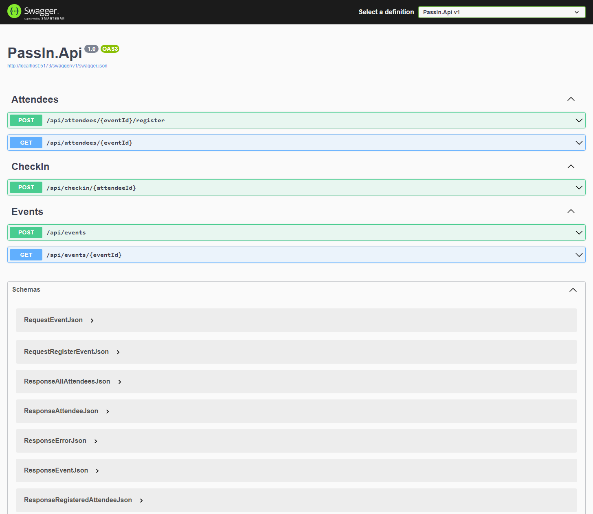

<p align="center">
  <a href="" rel="noopener">
 </a>
</p>
<h1 align="center">Pass.in</h1>

<div align="center">

[]() <br>

</div>

---

## 📝 Table of Contents <a name = "en"></a>

- **[About](#about_en)**
- **[Application Flow](#application_flow)**
- **[Getting Started](#getting_started_en)**
- **[Usage](#usage_en)**
- **[Project Structure](#project_structure_en)**
- **[Technologies](#built_using_en)**

## 📚 About <a name = "about_en"></a>

Pass.in is an Event Management System that allows users to manage events, register attendees, and generate event badges. It provides a set of API endpoints for creating events, registering attendees, checking in attendees, and retrieving event and attendee information.

## ➡ Application Flow <a name = "application_flow"></a>

<p align="center">
  <a href="" rel="noopener">
 </a
</p>

## 🏁 Getting Started <a name = "getting_started_en"></a>

These instructions will allow you to get a copy of the project and run the application locally for development and testing purposes.

### Prerequisites

- First, you need to have .NET installed on your machine. To do this, access the official .NET website by clicking [here](https://dotnet.microsoft.com/download) and follow the installation instructions for your operating system.<br />
- You also need to have an application to test HTTP requests, which is capable of making HTTP requests. For this, you can use Insomnia, Postman, Hoppscotch or any other application of your choice. You can also access Swagger documentation by visiting:

  > http://localhost:5173/swagger
  

### Installation

1. Clone the repository using the command or download the .zip file and extract the contents:

   ```sh
   git clone https://github.com/daniel-souto-rodrigues/passIn
   ```

2. Access the project folder.

3. in this case the application is using SQL Lite, you can also change it for a database compatible with EF.

6. Run the project in development mode or either using Visual Studio for example.

   ```sh
   dotnet run
   ```

## 🎈 Usage <a name="usage_en"></a>

To use the application, you can utilize the following API endpoints:

### pass.in routes

<details>
<summary>Events</summary>

### Create Event

- **Method:** POST
- **Route:** `/api/events`
- **Request body:**

  ```json
  {
    "title": "Event Name",
    "details": "Event Details",
    "maximumAttendees": 50
  }
  ```

- Example response:

  ```json
  {
  "id": "3fa85f64-5717-4562-b3fc-2c963f66afa6"
  }
  ```

### Get Event

- **Method:** GET
- **Route:** `/api/events/{{event_id}}`
- **Request parameters:**
  - eventId: Event id that can be obtained when creating the event or by accessing the data in the database
- **Request body:** `Not Required`
- Example response:

  ```json
  {
    "event": {
      "id": "16b9c10f-c291-419a-b76d-48c7b80a9577",
      "title": "Event Title",
      "details": "Event Details",
      "maximumAttendees": 50,
      "slug": "event-title",
      "totalAttendees": 1
    }
  }
  ```

</details>

<details>
<summary>Attendees</summary>

### Register Attendee for Event

- **Method:** POST
- **Route:** `/api/attendees/{{event_id}}/register`
- **Request parameters:**
  - `eventId`: Event id that can be obtained when creating the event or by accessing the data in the database
- **Request body:**

  ```json
  {
    "name": "Attendee Name",
    "email": "Attendee@email.com"
  }
  ```

- Example response:

  ```json
  {
  "id": "3fa85f64-5717-4562-b3fc-2c963f66afa6"
  }
  ```

### Get Event Attendees

- **Method:** GET
- **Route:** `/api/attendees/{{event_id}}`
- **Request parameters:**
  - `eventId`: Event id that can be obtained when creating the event or by accessing the data in the database
- **Request body:** `Not Required`

- Example response:

  ```json
  {
    "attendees": [
      {
        "id": 1,
        "name": "Attendee 1",
        "email": "Attendee1@email.com",
        "createdAt": "2024-04-03T21:09:57.423Z",
        "checkedInAt": "2024-04-03T21:11:08.734Z"
      },
      {
        "id": 2,
        "name": "Attendee 2",
        "email": "Attendee2@email.com",
        "createdAt": "2024-04-04T21:09:57.423Z",
        "checkedInAt": "2024-04-04T21:11:08.734Z"
      }
    ]
  }
  ```
</details>

<details>
<summary>CheckIns</summary>

### Check In Attendee

- **Method:** GET
- **Route:** `/api/checkin/{{attendee_id}}`
- **Request parameters:**
  - `attendee_id`: Attendee id that can be obtained when registering the attendee on an Event or by accessing the data in the database
- **Request body:** `Not Required`

- Example response: `201 CREATED`

  ```Json
  {
    "id": "3fa85f64-5717-4562-b3fc-2c963f66afa6",
    "created_At": "2024-04-05T19:31:41.368Z"
  }
  ```

</details>

## 📁 Project Structure <a name = "project_structure_en"></a>

The project structure is as follows:

```
PassIn.Api
│   (Files and subdirectories for API related code)
├── PassIn.Application
│   (Files and subdirectories for application logic)
├── PassIn.Communication
│   (Files and subdirectories for communication modules)
├── PassIn.Exceptions
│   (Files and subdirectories for exception handling)
└── PassIn.Infrastructure
    (Files and subdirectories for infrastructure components)
```

## ⛏️ Technologies <a name = "built_using_en"></a>

- [x] [C#](https://learn.microsoft.com/pt-br/dotnet/csharp/) - Programming language
- [x] [EntityFrameworkCore](https://learn.microsoft.com/pt-br/ef/core/) - Framework/ORM
- [x] [SQL Lite](https://www.sqlite.org) - Database
- [x] [Swagger](https://swagger.io/) - API documentation
